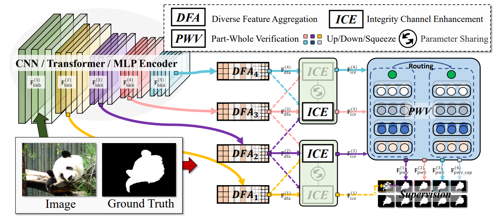
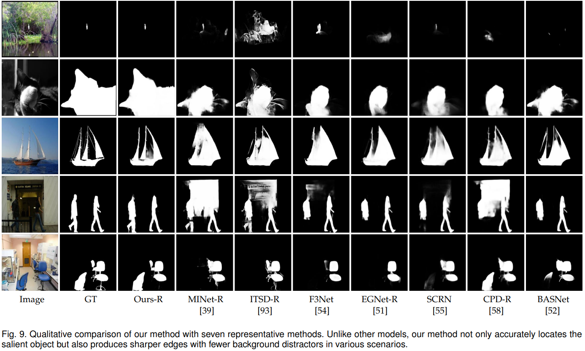
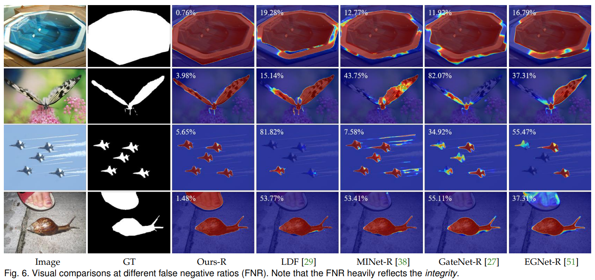
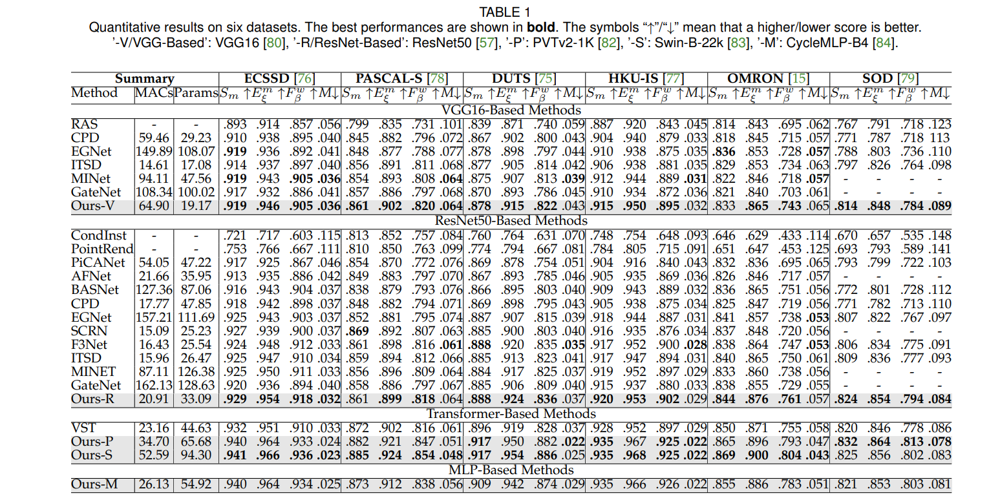
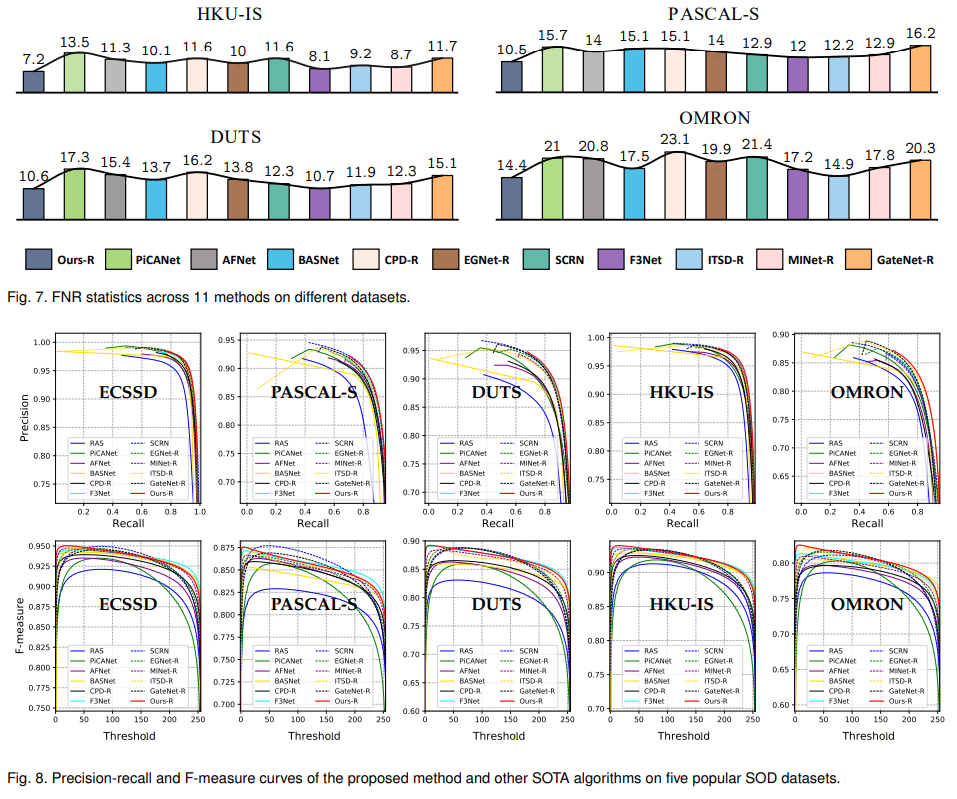

# <p align=center>`Salient Object Detection via Integrity Learning`</p><!-- omit in toc -->

> **Authors:**
> [Mingchen Zhuge](https://github.com/mczhuge),
> [Deng-Ping Fan](https://dengpingfan.github.io/),
> [Nian Liu](https://scholar.google.com/citations?user=ZSilWs4AAAAJ&hl=zh-CN),
> [Dingwen Zhang](https://scholar.google.com/citations?user=lKFZwK0AAAAJ&hl=zh-CN&oi=sra),
> [Dong Xu](https://scholar.google.com/citations?user=7Hdu5k4AAAAJ&hl=zh-CN), &
> [Ling Shao](https://scholar.google.com/citations?user=z84rLjoAAAAJ&hl=zh-CN).

This repository contains the source code, prediction results, and evaluation toolbox of our ICON method. The technical report could be found at [**[Paper]**](https://arxiv.org/pdf/2101.07663.pdf)[**[中文版]**](https://dengpingfan.github.io/papers/[2022][TPAMI]ICON_Chinese.pdf).

## Introduction
 

To facilitate integrity learning for SOD, we design a novel **I**ntegrity **Co**gnition **N**etwork (**ICON**), which explores three important components to learn strong integrity features. 1) Unlike the existing models that focus more on feature discriminability, we introduce a  diverse feature aggregation (DFA) component to aggregate features with various receptive fields (*i.e.,* kernel shape and context) and increase the feature diversity. Such diversity is the foundation for mining the integral salient objects. 2) Based on the DFA features, we introduce the integrity channel enhancement (ICE) component with the goal of enhancing feature channels that highlight the integral salient objects (*i.e.,* micro and macro levels) while suppressing the other distracting ones. 3) After extracting the enhanced features, the part-whole verification (PWV) method is employed to determine whether the part and whole object features have strong agreement. Such part-whole agreements can further improve the micro-level integrity for each salient object.

## News

☀️ [2022/12/21] ICON's results on COD benchmark could be found at [Google Drive](https://drive.google.com/drive/folders/1gsCeYtS9cwsMpTHQzkx81n4jsRK4LYdf). We appreciate [CamoFormer](https://github.com/HVision-NKU/CamoFormer)'s contribution, whose code is based on our ICON project as well.

☀️ [2022/07/05] Based on our code, Shi has published a [TCSVT paper (SCI-Q1)](https://ieeexplore.ieee.org/document/9852486). Congratulation!

☀️ This is a **friendly codebase** for new learners in SOD (or any binary segmentation tasks):

- it supports **VGG, ResNet, PVT, Swin, CycleMLP** as alternative encoders.

- it ensembles the quick **[SOD evaltools](https://github.com/mczhuge/SOCToolbox).**

- it releases an efficient way to conduct the **SOC dataset**.

- it gives a code for drawing PR/F-measre curves.


## Get Start

**0. Install**

You could refer to [here](https://github.com/mczhuge/ICON/tree/main/util).

**1. Download Datasets and Checkpoints.**

* **Datasets:** 

[Baidu | 提取码:ICON](https://pan.baidu.com/s/1zFXR-xIykUhoj86kiQ3GxA)  or [Goole Drive](https://drive.google.com/file/d/1aHYvxXGMsAS0yN4zhKt8kKorVL--9bLu/view?usp=sharing)

also you could quikcly download by running:
```
wget --load-cookies /tmp/cookies.txt "https://docs.google.com/uc?export=download&confirm=$(wget --quiet --save-cookies /tmp/cookies.txt --keep-session-cookies --no-check-certificate 'https://docs.google.com/uc?export=download&id=1aHYvxXGMsAS0yN4zhKt8kKorVL--9bLu' -O- | sed -rn 's/.*confirm=([0-9A-Za-z_]+).*/\1\n/p')&id=1aHYvxXGMsAS0yN4zhKt8kKorVL--9bLu" -O datasets.zip && rm -rf /tmp/cookies.txt
```

* **Checkpoints:** 

[Baidu | 提取码:ICON](https://pan.baidu.com/s/1zFXR-xIykUhoj86kiQ3GxA)  or [Goole Drive](https://drive.google.com/file/d/1wcL8n3lSc1pswMfDYCOBQJJjwnuhWdwK/view)

also you could quikcly download by running:
```
wget --load-cookies /tmp/cookies.txt "https://docs.google.com/uc?export=download&confirm=$(wget --quiet --save-cookies /tmp/cookies.txt --keep-session-cookies --no-check-certificate 'https://docs.google.com/uc?export=download&id=1wcL8n3lSc1pswMfDYCOBQJJjwnuhWdwK' -O- | sed -rn 's/.*confirm=([0-9A-Za-z_]+).*/\1\n/p')&id=1wcL8n3lSc1pswMfDYCOBQJJjwnuhWdwK" -O checkpoint.zip && rm -rf /tmp/cookies.txt
```

**2. Train ICON.**
```
sh util/scripts/train_icon.sh
```

**3. Test ICON.**
```
sh util/scripts/test_icon.sh
```

**4. Eval ICON.**
```
sh util/scripts/run_sod_eval.sh
sh util/scripts/run_soc_eval.sh
```

## Prediction Maps
- ICON-S saliency maps: [Baidu | 提取码:ICON](https://pan.baidu.com/s/18_61oFS2iTlsenFEFKAjzg) 
- ICON-P saliency maps: [Baidu | 提取码:ICON](https://pan.baidu.com/s/1Qk7rXrkdrkNgpeHbEaBZUA) 
- ICON-R saliency maps: [Baidu | 提取码:ICON](https://pan.baidu.com/s/13QxDdOMrSrXj_O_XlWwhbw) 
- ICON-V saliency maps: [Baidu | 提取码:ICON](https://pan.baidu.com/s/1lded2LsYb07uAMGDT9XNNA) 
- You can also find them in [Google Drive](- You can also find them in [Google Drive](https://drive.google.com/file/d/16_H322xYPAJ2RY35Gam3Y9bB6ctLJowr/view?usp=sharing).

<!--

## Qualitative Comparison
 
 
## Quantitative Comparison

 
-->

## Acknowlegement

Thanks [Dawn-bin](https://github.com/Dawn-bin) pointing out a code mistake.
And thanks [Jing-Hui Shi](https://github.com/shijinghuihub) contributes a MLP-encoder version.

## Citation
```
@article{zhuge2021salient,
  title={Salient Object Detection via Integrity Learning},
  author={Zhuge, Mingchen and Fan, Deng-Ping and Liu, Nian and Zhang, Dingwen and Xu, Dong and Shao, Ling},
  journal={IEEE Transactions on Pattern Analysis and Machine Intelligence},
  year={2022},
  publisher={IEEE}
}
```
