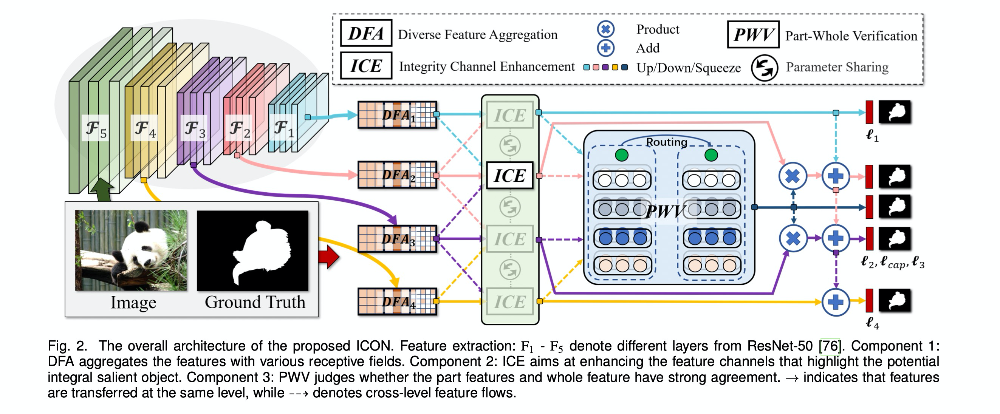
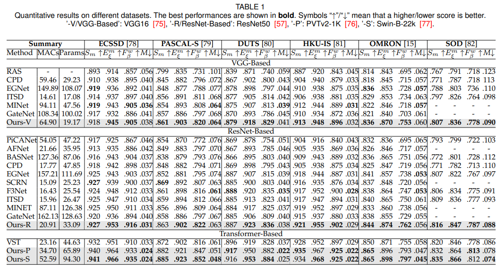
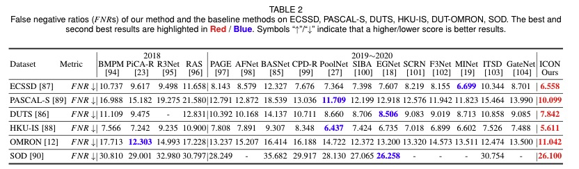
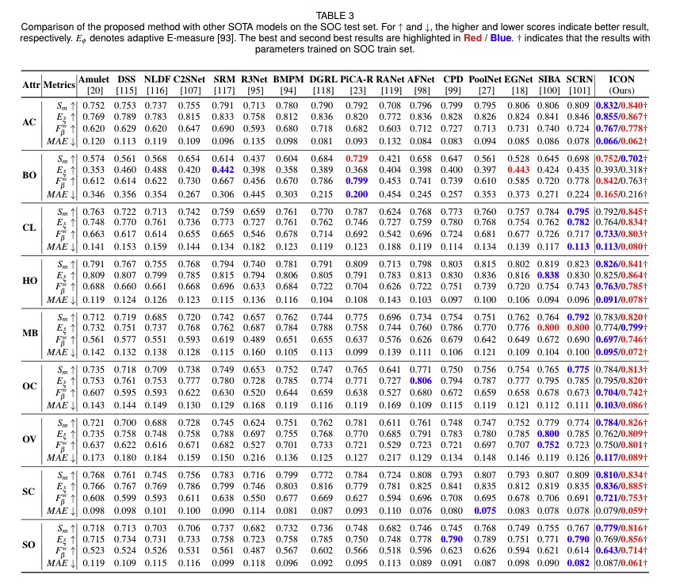
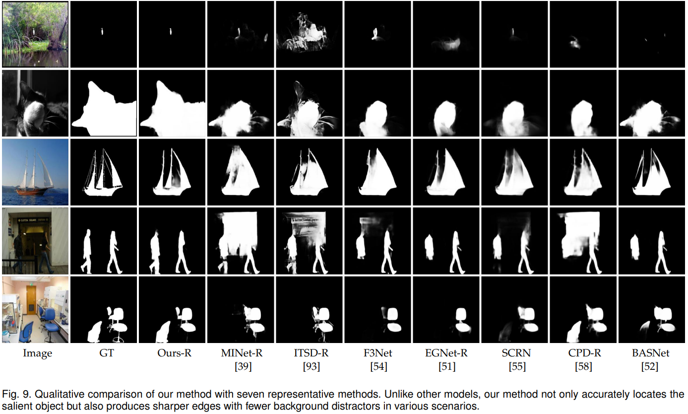

## [Salient Object Detection via Integrity Learning](https://arxiv.org/pdf/2101.07663.pdf)
by Mingchen Zhuge^, Deng-Ping Fan^, Nian Liu, Dingwen Zhang*, Dong Xu, Ling Shao.

## Introduction
 

Although current salient object detection (SOD) works have achieved fantastic progress, they are cast into the shade when it comes to the integrity of the predicted salient regions. We define the concept of integrity at both the micro and macro level. Specifically, at the micro level, the model should highlight all parts that belong to a certain salient object, while at the macro level, the model needs to discover all salient objects from the given image scene. To facilitate integrity learning for salient object detection, we design a novel Integrity Cognition Network (ICON), which explores three important components to learn strong integrity features. 1) Unlike the existing models that focus more on feature discriminability, we introduce a  diverse feature aggregation (DFA) component to aggregate features with various receptive fields (i.e., kernel shape and context) and increase the feature diversity. Such diversity is the foundation for mining the integral salient objects. 2) Based on the DFA features, we introduce the integrity channel enhancement (ICE) component with the goal of enhancing feature channels that highlight the integral salient objects (at both the micro and macro levels) while suppressing the other distracting ones. 3) After extracting the enhanced features, the part-whole verification (PWV) method is employed to determine whether the part and whole object features have strong agreement. Such part-whole agreements can further improve the micro-level integrity for each salient object. To demonstrate the effectiveness of ICON, comprehensive experiments are conducted on seven challenging benchmarks, where promising results are achieved.

## Code
Will be released soon.

## Prediction Maps
- saliency maps: [Baidu | 提取码:bopg](https://pan.baidu.com/s/19XV19I_0gfAjx2gwcweZcw) 
  We provide DUTS, DUT-OMRON, ECSSD, PASCAL-S, HKU-IS, SOD, SOC(trained on DUTS), SOC(trained on SOC). 
- camouflaged maps:  [Baidu | 提取码:ykfd](https://pan.baidu.com/s/1GHU712tkBDwfzPEfDeWT1A)
  We provide COD10K, CPD1K, CAMO, CHAMELEON.

## Quantitative Comparison
 
 
 

## Qualitative Comparison
 

## Citation
```
@article{zhuge2021salient,
  title={Salient Object Detection via Integrity Learning},
  author={Zhuge, Mingchen and Fan, Deng-Ping and Liu, Nian and Zhang, Dingwen and Xu, Dong and Shao, Ling},
  journal={arXiv preprint arXiv:2101.07663},
  year={2021}
}
```
